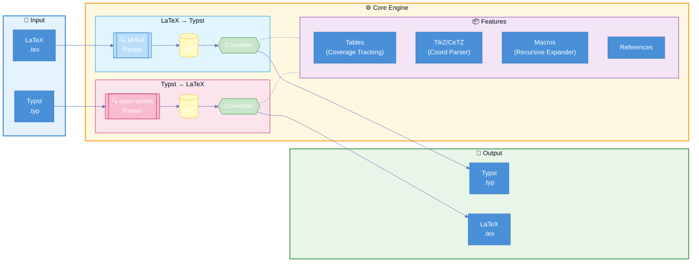

# Tylax

[](https://crates.io/crates/tylax)
[](https://docs.rs/tylax)
[](LICENSE)
[](https://github.com/scipenai/tylax/actions/workflows/ci.yml)

> **Bidirectional, AST-based LaTeX ↔ Typst Converter**

A tool written in Rust that converts mathematical formulas and full documents between LaTeX and Typst formats.

[English](README.md) | [中文](README_CN.md)

### 🔗 [Try Online Demo](https://convert.silkyai.cn)

## 🚀 Quick Look

```console
$ t2l input.tex -o output.typ
✓ Converted 1250 lines

$ cat math.tex
\frac{1}{2} + \int_0^\infty e^{-x} dx

$ t2l math.tex
1/2 + integral_(0)^(infinity) e^(- x) d x
```

## Table of Contents

- [Features](#features)
- [Why Tylax?](#why-tylax)
- [Supported Features](#supported-features)
- [Architecture](#architecture)
  - [Technical Highlights](#technical-highlights)
  - [Module Structure](#module-structure)
- [Installation](#installation)
- [Usage](#usage)
- [Conversion Examples](#conversion-examples)
- [WebAssembly](#webassembly)
- [Testing](#testing)
- [Contributing](#contributing)
- [License](#license)
- [Acknowledgments](#acknowledgments)

---

## Features

- **Bidirectional Conversion** - Supports both LaTeX → Typst and Typst → LaTeX
- **Document Support** - Handles headings, lists, tables, figures, and code blocks
- **Math Formulas** - Converts mathematical expressions with 700+ symbol mappings
- **Table Support** - Handles `\multirow`, `\multicolumn`, and nested tables
- **TikZ/CeTZ Graphics** - Basic conversion between TikZ and CeTZ drawing commands
- **Macro Expansion** - Supports `\def`, `\newcommand` in LaTeX and `#let` in Typst
- **WebAssembly** - Can be compiled to WASM for browser usage
- **CLI Tool** - Command-line interface for batch processing

## Why Tylax?

| Feature | Tylax | Pandoc | Regex Scripts |
|---------|------------------|--------|---------------|
| **Architecture** | AST (Rust) | AST (Haskell) | Regex |
| **Speed** | Native Binary | Haskell Runtime | Varies |
| **Bidirectional** | ✅ Yes | ✅ Yes | ❌ Usually One-way |
| **WASM Support** | ✅ Yes | ❌ Large Binary | ✅ Yes |
| **TikZ Support** | ✅ Partial (to CeTZ) | ❌ No | ❌ No |
| **Math Precision** | ✅ AST Preserved | ✅ AST Preserved | ⚠️ String Replacement |

## Supported Features

| Category | Features |
|----------|----------|
| **Math Environments** | `equation`, `align`, `gather`, `multline`, `matrix`, `pmatrix`, `bmatrix`, `cases`, etc. |
| **Document Structure** | `\section`, `\subsection`, `\title`, `\author`, `\tableofcontents`, `\appendix` |
| **Lists** | `itemize`, `enumerate`, `description` (with 3+ level nesting) |
| **Tables** | `tabular`, `longtable`, `tabularx`, `\multicolumn`, `\multirow`, booktabs |
| **References** | `\cite`, `\citep`, `\citet`, `\label`, `\ref`, `\eqref`, `\autoref` |
| **Figures** | `\includegraphics`, `figure` environment, `\caption` |
| **Code** | `verbatim`, `lstlisting`, `minted` |
| **Graphics** | TikZ (lines, circles, rectangles, nodes, arrows, bezier curves, arcs, grids, `\foreach`, fill patterns) |
| **Theorems** | `theorem`, `lemma`, `corollary`, `proof` (with QED symbol), `definition`, `remark` |
| **Extensions** | `siunitx` (`\SI`, `\si`), color commands, `\footnote` |

### Supported TikZ/CeTZ Features

| TikZ Feature | CeTZ Equivalent | Status |
|--------------|-----------------|--------|
| `\draw (a) -- (b)` | `line((a), (b))` | ✅ |
| `\draw (a) circle (r)` | `circle((a), radius: r)` | ✅ |
| `\draw (a) rectangle (b)` | `rect((a), (b))` | ✅ |
| `\draw (a) arc (s:e:r)` | `arc((a), start: s, stop: e, radius: r)` | ✅ |
| `\node at (a) {text}` | `content((a), [text])` | ✅ |
| `\draw[->]` arrows | `mark: (end: ">")` | ✅ |
| `\draw[dashed]` | `dash: "dashed"` | ✅ |
| `\draw[thick]` | `stroke: (thickness: 0.8pt)` | ✅ |
| `\draw[blue]` colors | `stroke: blue` | ✅ |
| `\fill[red!20]` | `fill: red.lighten(80%)` | ✅ |
| `.. controls (c) ..` bezier | `bezier(...)` | ✅ |
| `\foreach \x in {...}` | `for x in (...) {...}` | ⚠️ Partial |
| `node[right]` anchors | `anchor: "west"` | ✅ |
| `\clip` regions | Comment only | ⚠️ Partial |

### Limitations

While Tylax uses advanced AST-based parsing, please note:

- **Complex Macros**: Highly dynamic TeX macros or complex packages (like `tcolorbox`) may require manual adjustment.
- **Styling**: Typst's styling system differs significantly from LaTeX; some visual adjustments are expected after conversion.
- **Compilation**: This tool converts *syntax*, it does not execute the full TeX engine (e.g., `\newcounter`, complex `\if`).

---

## Architecture

This project uses **AST-based parsing** for high-precision bidirectional conversion:

- **LaTeX parsing**: [MiTeX](https://github.com/mitex-rs/mitex) - High-performance LaTeX parser with Rowan AST
- **Typst parsing**: [typst-syntax](https://github.com/typst/typst) - Official Typst syntax parser



### Technical Implementation

> **Key technical details distinguishing this project from regex-based converters**

<details>
<summary><b>📊 State-aware Table Handling — coverage tracking for multirow/multicolumn</b></summary>

- **Core idea**: maintain a `col_coverage[]` array while streaming cells; skip “phantom” placeholders created by row/col spans.
- **Why it matters**: `\multirow`/`\multicolumn` spans won’t shift later cells (supports nested spans).
- **Where in code**: `src/core/latex2typst/table/parser.rs`, `src/features/tables.rs`, plus table markers in `src/core/latex2typst/markup.rs`.

</details>

<details>
<summary><b>🎨 TikZ → CeTZ — multi-coordinate-system parser</b></summary>

- **Core idea**: parse multiple TikZ coordinate systems (absolute / relative / polar / named / calc) and normalize for CeTZ output.
- **Why it matters**: real TikZ documents mix coordinate styles; a 1:1 regex mapping breaks quickly.
- **Where in code**: `src/features/tikz.rs` (`Coordinate` parsing + conversion).

</details>

<details>
<summary><b>🔄 Depth-limited Macro Expansion — recursive expander with limit</b></summary>

- **Core idea**: expand `\newcommand` / `\def` / `\DeclareMathOperator` before parsing, with a recursion depth limit.
- **Why it matters**: prevents infinite loops for self-referential macros, while still supporting common macro-based writing styles.
- **Where in code**: `src/features/macros.rs` (e.g., `MAX_EXPANSION_DEPTH`).

</details>

<details>
<summary><b>🧠 AST-Driven Conversion — context-aware conversion (math vs text)</b></summary>

- **Core idea**: parse to AST first, then convert with context/state (math mode, environments, labels, etc.).
- **Why it matters**: handles deeply nested structures (e.g., `\frac{\frac{a}{b}}{c}`) and avoids regex corner cases.
- **Where in code**: `src/core/latex2typst/*`, `src/core/typst2latex/*`.

</details>

### Module Structure

<details>
<summary><b>Show module layout</b></summary>

```
src/
├── core/
│   ├── latex2typst/     # LaTeX → Typst conversion
│   │   ├── context.rs   # Conversion state & options
│   │   ├── environment.rs # Environment handling
│   │   ├── math.rs      # Math formula conversion
│   │   ├── markup.rs    # Document structure (2000+ lines)
│   │   └── table/       # Smart table parser with coverage tracking
│   └── typst2latex/     # Typst → LaTeX conversion
│       ├── context.rs   # Conversion state
│       ├── math.rs      # Math conversion
│       ├── markup.rs    # Markup conversion
│       └── table/       # Table handling with hline support
├── features/
│   ├── tikz.rs          # TikZ ↔ CeTZ with 5 coordinate systems
│   ├── tables.rs        # Complex table support
│   ├── refs.rs          # Citations & references
│   ├── macros.rs        # Depth-limited macro expansion
│   └── bibtex.rs        # Bibliography parsing
├── data/
│   ├── maps.rs          # 700+ symbol mappings
│   ├── symbols.rs       # Greek, operators, arrows
│   └── siunitx.rs       # SI units support
└── utils/
    ├── diagnostics.rs   # Error reporting
    └── files.rs         # Multi-file support
```

</details>

---

## Installation

### From crates.io

```bash
cargo install tylax
```

### From Source

```bash
git clone https://github.com/scipenai/tylax.git
cd tylax
cargo build --release
```

### As a Library

Add to your `Cargo.toml`:

```toml
[dependencies]
tylax = "0.1.0"
```

---

## Usage

### Command Line

```bash
# Math formula conversion
t2l input.tex -d l2t              # LaTeX → Typst
t2l input.typ -d t2l              # Typst → LaTeX

# Full document conversion
t2l input.tex -d l2t -f           # LaTeX document → Typst
t2l input.typ -d t2l -f           # Typst document → LaTeX

# Auto-detect format
t2l input.tex                     # Detect by extension
t2l input.tex -o output.typ       # Specify output file

# From stdin
echo '\frac{1}{2}' | t2l -d l2t

# TikZ/CeTZ conversion
t2l tikz input.tex -o output.typ  # TikZ → CeTZ
t2l tikz input.typ -o output.tex  # CeTZ → TikZ (auto-detect)

# Batch conversion
t2l batch ./latex_files -o ./typst_output -d l2t -f

# Check LaTeX for issues
t2l check input.tex

# Show version and features
t2l info
```

### Library API

#### Math Formula Conversion

```rust
use tylax::{latex_to_typst, typst_to_latex};

// LaTeX → Typst
let typst = latex_to_typst(r"\frac{1}{2} + \alpha^2");
// Output: "1/2 + alpha^(2)"

// Typst → LaTeX
let latex = typst_to_latex("frac(1, 2) + alpha^2");
// Output: "\frac{1}{2} + \alpha^{2}"
```

#### Document Conversion

```rust
use tylax::{latex_document_to_typst, typst_document_to_latex};

let latex_doc = r#"
\documentclass{article}
\title{My Paper}
\begin{document}
\section{Introduction}
Hello, world!
\end{document}
"#;

let typst = latex_document_to_typst(latex_doc);
```

#### TikZ/CeTZ Graphics Conversion

```rust
use tylax::tikz::{convert_tikz_to_cetz, convert_cetz_to_tikz};

// TikZ → CeTZ
let tikz = r"\begin{tikzpicture}\draw (0,0) -- (1,1);\end{tikzpicture}";
let cetz = convert_tikz_to_cetz(tikz);

// CeTZ → TikZ
let cetz = "line((0, 0), (1, 1))";
let tikz = convert_cetz_to_tikz(cetz);
```

---

## Conversion Examples

### Math Formulas (LaTeX → Typst)

| LaTeX | Typst |
|-------|-------|
| `\frac{1}{2}` | `1/2` |
| `\sqrt{x^2 + y^2}` | `sqrt(x^(2) + y^(2))` |
| `\sum_{i=1}^{n} i^2` | `sum_(i = 1)^(n) i^(2)` |
| `\int_0^\infty e^{-x} dx` | `integral_(0)^(infinity) e^(- x) d x` |
| `\lim_{n \to \infty}` | `lim_(n -> infinity)` |
| `\alpha + \beta = \gamma` | `alpha + beta = gamma` |
| `\begin{pmatrix} a & b \\ c & d \end{pmatrix}` | `mat(delim: "(", a, b ; c, d)` |
| `\mathbb{R}` | `RR` |
| `\vec{v}` | `arrow(v)` |
| `\nabla \times \vec{E}` | `nabla times arrow(E)` |
| `\underbrace{x+y}_{text}` | `underbrace(x + y)_(t e x t)` |
| `\begin{cases} x \\ y \end{cases}` | `cases(x, y)` |
| `\oint_{\partial S}` | `integral.cont_(partial S)` |

### Document Structure (Typst → LaTeX)

| Typst | LaTeX |
|-------|-------|
| `= Title` | `\section{ Title}` |
| `== Subtitle` | `\subsection{ Subtitle}` |
| `*bold*` | `\textbf{bold}` |
| `_italic_` | `\textit{italic}` |
| `` `code` `` | `\texttt{code}` |
| `@label` | `\ref{label}` |
| `$x + y$` | `$x + y$` |
| `$ x + y $` | `\[ x + y \]` |

### Graphics (TikZ ↔ CeTZ)

| TikZ | CeTZ |
|------|------|
| `\draw (0,0) -- (1,1);` | `line((0, 0), (1, 1))` |
| `\draw (0,0) circle (1);` | `circle((0, 0), radius: 1)` |
| `\node at (0,0) {text};` | `content((0, 0), [text])` |
| `\draw[->] (0,0) -- (1,0);` | `line((0, 0), (1, 0), mark: (end: ">"))` |
| `\draw[<->] (0,0) -- (1,0);` | `line((0, 0), (1, 0), mark: (start: ">", end: ">"))` |
| `\draw (0,0) rectangle (1,1);` | `rect((0, 0), (1, 1))` |
| `\draw[blue, thick] ...` | `stroke: (paint: blue, thickness: 0.8pt)` |
| `\draw[dashed] ...` | `stroke: (dash: "dashed")` |
| `\draw[fill=green!20] ...` | `fill: green.lighten(80%)` |
| `\node[right] at (0,0) {x};` | `content((0, 0), [x], anchor: "west")` |
| `\draw .. controls (a) and (b) ..` | `bezier(..., (a), (b), ...)` |
| `\draw (0,0) arc (0:90:1);` | `arc((0, 0), start: 0deg, stop: 90deg, radius: 1)` |

#### Complete TikZ Example

**Input (TikZ):**
```latex
\begin{tikzpicture}
  \draw[thick, ->] (0,0) -- (4,0) node[right] {$x$};
  \draw[thick, ->] (0,0) -- (0,3) node[above] {$y$};
  \draw[blue, thick] (0,0) -- (3,2);
  \draw[red, dashed] (0,2) -- (3,2) -- (3,0);
  \draw[green, fill=green!20] (2,1.5) circle (0.5);
  \node at (3,2) [above right] {$(3,2)$};
\end{tikzpicture}
```

**Output (CeTZ):**
```typst
#import "@preview/cetz:0.2.2": canvas, draw

#canvas({
  import draw: *

  content((4, 0), [\$x\$], anchor: "west")
  line((0, 0), (4, 0), stroke: (thickness: 0.8pt), mark: (end: ">"))
  content((0, 3), [\$y\$], anchor: "south")
  line((0, 0), (0, 3), stroke: (thickness: 0.8pt), mark: (end: ">"))
  line((0, 0), (3, 2), stroke: (paint: blue, thickness: 0.8pt))
  line((0, 2), (3, 2), (3, 0), stroke: (paint: red, dash: "dashed"))
  circle((2, 1.5), radius: 0.5, stroke: green, fill: green.lighten(80%))
  content((3, 2), [\$(3,2)\$], anchor: "south-west")
})
```

---

## WebAssembly

### Build WASM

```bash
# Install wasm-pack
cargo install wasm-pack

# Build
wasm-pack build --target web --out-dir web/src/pkg --features wasm --no-default-features
```

### Use in Browser

```javascript
import init, { 
  latexToTypst, 
  typstToLatex, 
  latexDocumentToTypst,
  typstDocumentToLatex,
  tikzToCetz, 
  cetzToTikz,
  checkLatex,
  detectFormat,
  getVersion 
} from './pkg/tylax.js';

await init();

// Math conversion
const typst = latexToTypst("\\frac{1}{2}");
console.log(typst); // "1/2"

// Document conversion
const typstDoc = latexDocumentToTypst("\\documentclass{article}...");

// Graphics conversion
const cetz = tikzToCetz("\\begin{tikzpicture}\\draw (0,0) -- (1,1);\\end{tikzpicture}");

// Format detection
const format = detectFormat("$x + y$"); // "typst" or "latex"

// Check LaTeX for issues
const issues = checkLatex("\\frac{1}");
if (issues.has_errors) {
  console.error("Errors:", issues.errors);
}

// Version info
console.log("Version:", getVersion());
```

---

## Project Structure

```
tylax/
├── src/
│   ├── lib.rs              # Library entry point
│   ├── core/
│   │   ├── latex2typst/    # LaTeX → Typst conversion (AST-based)
│   │   └── typst2latex/    # Typst → LaTeX conversion (modular)
│   ├── data/
│   │   ├── maps.rs         # Symbol mappings (700+ entries)
│   │   ├── constants.rs    # Static constants & theorem types
│   │   └── symbols.rs      # Symbol helpers & delimiters
│   ├── features/
│   │   ├── tikz.rs         # TikZ ↔ CeTZ bidirectional conversion
│   │   ├── bibtex.rs       # Bibliography handling
│   │   └── templates.rs    # Document templates
│   ├── utils/
│   │   ├── diagnostics.rs  # LaTeX checking & warnings
│   │   └── error.rs        # Structured error types
│   ├── wasm.rs             # WebAssembly bindings
│   └── bin/
│       └── t2l.rs          # CLI application
├── web/                    # Web frontend
├── tests/                  # Integration tests
└── tools/                  # Build & code generation tools
```

---

## Testing

```bash
# Run all tests
cargo test --release

# Run specific module tests
cargo test latex2typst      # LaTeX → Typst tests
cargo test typst2latex      # Typst → LaTeX tests
cargo test tikz             # TikZ/CeTZ tests
cargo test integration      # Integration tests

# With output
cargo test -- --nocapture
```

### Test Coverage

| Category | Test Cases | Status |
|----------|------------|--------|
| Math formulas (L→T) | Basic, complex, matrices, cases | ✅ |
| Math formulas (T→L) | Basic, complex, matrices, cases | ✅ |
| Documents (L→T) | Sections, lists, tables, theorems, bibliography | ✅ |
| Documents (T→L) | Headings, formatting, math | ✅ |
| TikZ → CeTZ | Lines, shapes, arrows, bezier, nodes, fills | ✅ |
| CeTZ → TikZ | Lines, shapes, content, basic styles | ✅ |
| Integration | Full document conversion, auto-detection, roundtrip | ✅ |

---

## Contributing

Contributions are welcome! Please feel free to submit issues and pull requests.

1. Fork the repository
2. Create your feature branch (`git checkout -b feature/amazing-feature`)
3. Commit your changes (`git commit -m 'Add amazing feature'`)
4. Push to the branch (`git push origin feature/amazing-feature`)
5. Open a Pull Request

### Development Guidelines

- Follow Rust coding conventions
- Add tests for new features
- Update documentation as needed
- Run `cargo fmt` and `cargo clippy` before committing

---

## License

This project is licensed under the Apache-2.0 License - see the [LICENSE](LICENSE) file for details.

---

## Acknowledgments

This project builds upon the following excellent projects:

- [MiTeX](https://github.com/mitex-rs/mitex) - High-performance LaTeX parser
- [tex2typst](https://github.com/qwinsi/tex2typst) - Symbol mapping reference
- [typst-syntax](https://github.com/typst/typst) - Official Typst syntax parser
- [Pandoc](https://github.com/jgm/pandoc) - Document structure conversion reference
