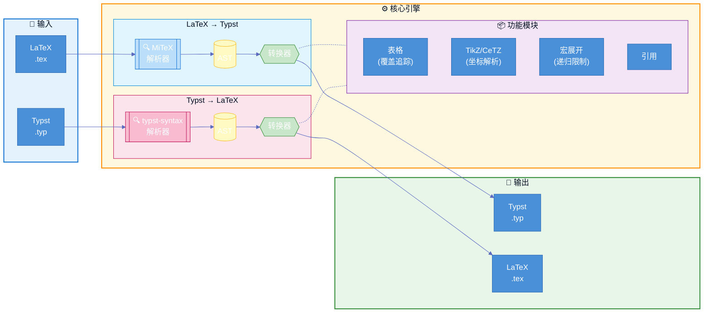

# Tylax

[](https://crates.io/crates/tylax)
[](https://docs.rs/tylax)
[](LICENSE)
[](https://github.com/scipenai/tylax/actions/workflows/ci.yml)

> **双向、基于 AST 的 LaTeX ↔ Typst 转换器**

一个用 Rust 编写的工具，可在 LaTeX 和 Typst 格式之间转换数学公式和完整文档。

[English](README.md) | [中文](README_CN.md)

### 🔗 [在线演示 Demo](https://convert.silkyai.cn)

## 🚀 快速预览

```console
$ t2l input.tex -o output.typ
✓ 已转换 1250 行

$ cat math.tex
\frac{1}{2} + \int_0^\infty e^{-x} dx

$ t2l math.tex
1/2 + integral_(0)^(infinity) e^(- x) d x
```

## 目录

- [功能特性](#功能特性)
- [为什么选择 Tylax？](#为什么选择-tylax)
- [支持的功能](#支持的功能)
- [架构](#架构)
  - [技术亮点](#技术亮点)
  - [模块结构](#模块结构)
- [安装](#安装)
- [使用方法](#使用方法)
- [转换示例](#转换示例)
- [WebAssembly](#webassembly)
- [测试](#测试)
- [贡献](#贡献)
- [许可证](#许可证)
- [致谢](#致谢)

---

## 功能特性

- **双向转换** - 支持 LaTeX → Typst 和 Typst → LaTeX
- **文档支持** - 处理标题、列表、表格、图片、代码块
- **数学公式** - 转换数学表达式，包含 700+ 符号映射
- **表格支持** - 处理 `\multirow`、`\multicolumn` 和嵌套表格
- **TikZ/CeTZ 图形** - TikZ 和 CeTZ 绘图命令的基础转换
- **宏展开** - 支持 LaTeX 的 `\def`、`\newcommand` 和 Typst 的 `#let`
- **WebAssembly** - 可编译为 WASM 在浏览器中使用
- **命令行工具** - 提供批量处理的命令行接口

## 为什么选择 Tylax？

| 特性 | Tylax | Pandoc | 正则脚本 |
|------|------------------|--------|----------|
| **架构** | AST (Rust) | AST (Haskell) | 正则表达式 |
| **速度** | 原生二进制 | Haskell 运行时 | 不定 |
| **双向支持** | ✅ 是 | ✅ 是 | ❌ 通常单向 |
| **WASM 支持** | ✅ 是 | ❌ 二进制较大 | ✅ 是 |
| **TikZ 支持** | ✅ 部分 (转 CeTZ) | ❌ 无 | ❌ 无 |
| **公式精度** | ✅ 保留 AST 结构 | ✅ 保留 AST 结构 | ⚠️ 字符串替换 |

## 支持的功能

| 类别 | 功能 |
|------|------|
| **数学环境** | `equation`, `align`, `gather`, `multline`, `matrix`, `pmatrix`, `bmatrix`, `cases` 等 |
| **文档结构** | `\section`, `\subsection`, `\title`, `\author`, `\tableofcontents`, `\appendix` |
| **列表** | `itemize`, `enumerate`, `description`（支持 3+ 层嵌套） |
| **表格** | `tabular`, `longtable`, `tabularx`, `\multicolumn`, `\multirow`, booktabs |
| **引用** | `\cite`, `\citep`, `\citet`, `\label`, `\ref`, `\eqref`, `\autoref` |
| **图片** | `\includegraphics`, `figure` 环境, `\caption` |
| **代码** | `verbatim`, `lstlisting`, `minted` |
| **图形** | TikZ（线条、圆、矩形、节点、箭头、贝塞尔曲线、圆弧、网格、`\foreach`、填充模式） |
| **定理** | `theorem`, `lemma`, `corollary`, `proof`（带 QED 符号）, `definition`, `remark` |
| **扩展** | `siunitx`（`\SI`, `\si`）、颜色命令、`\footnote` |

### 支持的 TikZ/CeTZ 功能

| TikZ 功能 | CeTZ 等效写法 | 状态 |
|-----------|---------------|------|
| `\draw (a) -- (b)` | `line((a), (b))` | ✅ |
| `\draw (a) circle (r)` | `circle((a), radius: r)` | ✅ |
| `\draw (a) rectangle (b)` | `rect((a), (b))` | ✅ |
| `\draw (a) arc (s:e:r)` | `arc((a), start: s, stop: e, radius: r)` | ✅ |
| `\node at (a) {text}` | `content((a), [text])` | ✅ |
| `\draw[->]` 箭头 | `mark: (end: ">")` | ✅ |
| `\draw[dashed]` | `dash: "dashed"` | ✅ |
| `\draw[thick]` | `stroke: (thickness: 0.8pt)` | ✅ |
| `\draw[blue]` 颜色 | `stroke: blue` | ✅ |
| `\fill[red!20]` | `fill: red.lighten(80%)` | ✅ |
| `.. controls (c) ..` 贝塞尔 | `bezier(...)` | ✅ |
| `\foreach \x in {...}` | `for x in (...) {...}` | ⚠️ 部分 |
| `node[right]` 锚点 | `anchor: "west"` | ✅ |
| `\clip` 裁剪区域 | 仅注释 | ⚠️ 部分 |

### 局限性 (Limitations)

尽管 Tylax 使用了先进的基于 AST 的解析技术，但请注意：

- **复杂宏**: 高度动态的 TeX 宏或复杂的宏包（如 `tcolorbox`）可能需要手动调整。
- **样式差异**: Typst 的样式系统与 LaTeX 差异较大，转换后通常需要进行一些视觉微调。
- **编译执行**: 本工具进行的是*语法转换*，并不运行完整的 TeX 引擎（例如，不支持复杂的 `\newcounter` 计数器逻辑或 `\if` 条件分支执行）。

---

## 架构

本项目使用**基于 AST 的解析**实现高精度双向转换：

- **LaTeX 解析**: [MiTeX](https://github.com/mitex-rs/mitex) - 基于 Rowan AST 的高性能 LaTeX 解析器
- **Typst 解析**: [typst-syntax](https://github.com/typst/typst) - 官方 Typst 语法解析器



### 技术实现

> **区别于正则替换的关键技术细节**

<details>
<summary><b>📊 状态感知表格处理 — multirow/multicolumn 覆盖追踪</b></summary>

- **核心思路**：在流式遍历单元格时维护 `col_coverage[]`，跳过跨行/跨列产生的“幽灵占位单元格”。  
- **价值**：避免跨行/跨列导致的后续单元格错位（支持嵌套 span）。
- **对应代码**：`src/core/latex2typst/table/parser.rs`、`src/features/tables.rs`，以及 `src/core/latex2typst/markup.rs` 中的表格标记。

</details>

<details>
<summary><b>🎨 TikZ → CeTZ — 多坐标系统解析</b></summary>

- **核心思路**：解析 TikZ 多种坐标系统（绝对 / 相对 / 极坐标 / 命名 / calc），并统一为 CeTZ 输出。
- **价值**：真实 TikZ 文档常混用坐标写法，正则映射很快失效。
- **对应代码**：`src/features/tikz.rs`（`Coordinate` 解析与转换）。

</details>

<details>
<summary><b>🔄 深度限制宏展开 — 带上限的递归展开器</b></summary>

- **核心思路**：在 AST 解析前展开 `\newcommand` / `\def` / `\DeclareMathOperator`，并设置递归深度上限。
- **价值**：既支持常见宏写法，又能避免递归宏无限展开。
- **对应代码**：`src/features/macros.rs`（例如 `MAX_EXPANSION_DEPTH`）。

</details>

<details>
<summary><b>🧠 AST 驱动转换 — 上下文感知（数学模式 vs 文本模式）</b></summary>

- **核心思路**：先解析为 AST，再结合上下文/状态（数学模式、环境栈、label 等）进行转换。
- **价值**：稳定处理深层嵌套结构（如 `\frac{\frac{a}{b}}{c}`），减少正则角落问题。
- **对应代码**：`src/core/latex2typst/*`、`src/core/typst2latex/*`。

</details>

### 模块结构

<details>
<summary><b>展开查看模块目录</b></summary>

```
src/
├── core/
│   ├── latex2typst/     # LaTeX → Typst 转换
│   │   ├── context.rs   # 转换状态与选项
│   │   ├── environment.rs # 环境处理
│   │   ├── math.rs      # 数学公式转换
│   │   ├── markup.rs    # 文档结构 (2000+ 行)
│   │   └── table/       # 带覆盖追踪的智能表格解析器
│   └── typst2latex/     # Typst → LaTeX 转换
│       ├── context.rs   # 转换状态
│       ├── math.rs      # 数学转换
│       ├── markup.rs    # 标记转换
│       └── table/       # 带 hline 支持的表格处理
├── features/
│   ├── tikz.rs          # TikZ ↔ CeTZ，支持 5 种坐标系统
│   ├── tables.rs        # 复杂表格支持
│   ├── refs.rs          # 引用与交叉引用
│   ├── macros.rs        # 深度限制的宏展开
│   └── bibtex.rs        # 参考文献解析
├── data/
│   ├── maps.rs          # 700+ 符号映射
│   ├── symbols.rs       # 希腊字母、运算符、箭头
│   └── siunitx.rs       # SI 单位支持
└── utils/
    ├── diagnostics.rs   # 错误报告
    └── files.rs         # 多文件支持
```

</details>

---

## 安装

### 从 crates.io 安装

```bash
cargo install tylax
```

### 从源码构建

```bash
git clone https://github.com/scipenai/tylax.git
cd tylax
cargo build --release
```

### 作为库使用

在 `Cargo.toml` 中添加：

```toml
[dependencies]
tylax = "0.1.0"
```

---

## 使用方法

### 命令行

```bash
# 数学公式转换
t2l input.tex -d l2t              # LaTeX → Typst
t2l input.typ -d t2l              # Typst → LaTeX

# 完整文档转换
t2l input.tex -d l2t -f           # LaTeX 文档 → Typst
t2l input.typ -d t2l -f           # Typst 文档 → LaTeX

# 自动检测格式
t2l input.tex                     # 根据扩展名检测
t2l input.tex -o output.typ       # 指定输出文件

# 从标准输入读取
echo '\frac{1}{2}' | t2l -d l2t

# TikZ/CeTZ 图形转换
t2l tikz input.tex -o output.typ  # TikZ → CeTZ
t2l tikz input.typ -o output.tex  # CeTZ → TikZ（自动检测）

# 批量转换
t2l batch ./latex_files -o ./typst_output -d l2t -f

# 检查 LaTeX 问题
t2l check input.tex

# 显示版本和功能信息
t2l info
```

### 库 API

#### 数学公式转换

```rust
use tylax::{latex_to_typst, typst_to_latex};

// LaTeX → Typst
let typst = latex_to_typst(r"\frac{1}{2} + \alpha^2");
// 输出: "1/2 + alpha^(2)"

// Typst → LaTeX
let latex = typst_to_latex("frac(1, 2) + alpha^2");
// 输出: "\frac{1}{2} + \alpha^{2}"
```

#### 文档转换

```rust
use tylax::{latex_document_to_typst, typst_document_to_latex};

let latex_doc = r#"
\documentclass{article}
\title{My Paper}
\begin{document}
\section{Introduction}
Hello, world!
\end{document}
"#;

let typst = latex_document_to_typst(latex_doc);
```

#### TikZ/CeTZ 图形转换

```rust
use tylax::tikz::{convert_tikz_to_cetz, convert_cetz_to_tikz};

// TikZ → CeTZ
let tikz = r"\begin{tikzpicture}\draw (0,0) -- (1,1);\end{tikzpicture}";
let cetz = convert_tikz_to_cetz(tikz);

// CeTZ → TikZ
let cetz = "line((0, 0), (1, 1))";
let tikz = convert_cetz_to_tikz(cetz);
```

---

## 转换示例

### 数学公式（LaTeX → Typst）

| LaTeX | Typst |
|-------|-------|
| `\frac{1}{2}` | `1/2` |
| `\sqrt{x^2 + y^2}` | `sqrt(x^(2) + y^(2))` |
| `\sum_{i=1}^{n} i^2` | `sum_(i = 1)^(n) i^(2)` |
| `\int_0^\infty e^{-x} dx` | `integral_(0)^(infinity) e^(- x) d x` |
| `\lim_{n \to \infty}` | `lim_(n -> infinity)` |
| `\alpha + \beta = \gamma` | `alpha + beta = gamma` |
| `\begin{pmatrix} a & b \\ c & d \end{pmatrix}` | `mat(delim: "(", a, b ; c, d)` |
| `\mathbb{R}` | `RR` |
| `\vec{v}` | `arrow(v)` |
| `\nabla \times \vec{E}` | `nabla times arrow(E)` |
| `\underbrace{x+y}_{text}` | `underbrace(x + y)_(t e x t)` |
| `\begin{cases} x \\ y \end{cases}` | `cases(x, y)` |
| `\oint_{\partial S}` | `integral.cont_(partial S)` |

### 文档结构（Typst → LaTeX）

| Typst | LaTeX |
|-------|-------|
| `= Title` | `\section{ Title}` |
| `== Subtitle` | `\subsection{ Subtitle}` |
| `*bold*` | `\textbf{bold}` |
| `_italic_` | `\textit{italic}` |
| `` `code` `` | `\texttt{code}` |
| `@label` | `\ref{label}` |
| `$x + y$` | `$x + y$` |
| `$ x + y $` | `\[ x + y \]` |

### 图形（TikZ ↔ CeTZ）

| TikZ | CeTZ |
|------|------|
| `\draw (0,0) -- (1,1);` | `line((0, 0), (1, 1))` |
| `\draw (0,0) circle (1);` | `circle((0, 0), radius: 1)` |
| `\node at (0,0) {text};` | `content((0, 0), [text])` |
| `\draw[->] (0,0) -- (1,0);` | `line((0, 0), (1, 0), mark: (end: ">"))` |
| `\draw[<->] (0,0) -- (1,0);` | `line((0, 0), (1, 0), mark: (start: ">", end: ">"))` |
| `\draw (0,0) rectangle (1,1);` | `rect((0, 0), (1, 1))` |
| `\draw[blue, thick] ...` | `stroke: (paint: blue, thickness: 0.8pt)` |
| `\draw[dashed] ...` | `stroke: (dash: "dashed")` |
| `\draw[fill=green!20] ...` | `fill: green.lighten(80%)` |
| `\node[right] at (0,0) {x};` | `content((0, 0), [x], anchor: "west")` |
| `\draw .. controls (a) and (b) ..` | `bezier(..., (a), (b), ...)` |
| `\draw (0,0) arc (0:90:1);` | `arc((0, 0), start: 0deg, stop: 90deg, radius: 1)` |

#### 完整 TikZ 示例

**输入（TikZ）：**
```latex
\begin{tikzpicture}
  \draw[thick, ->] (0,0) -- (4,0) node[right] {$x$};
  \draw[thick, ->] (0,0) -- (0,3) node[above] {$y$};
  \draw[blue, thick] (0,0) -- (3,2);
  \draw[red, dashed] (0,2) -- (3,2) -- (3,0);
  \draw[green, fill=green!20] (2,1.5) circle (0.5);
  \node at (3,2) [above right] {$(3,2)$};
\end{tikzpicture}
```

**输出（CeTZ）：**
```typst
#import "@preview/cetz:0.2.2": canvas, draw

#canvas({
  import draw: *

  content((4, 0), [\$x\$], anchor: "west")
  line((0, 0), (4, 0), stroke: (thickness: 0.8pt), mark: (end: ">"))
  content((0, 3), [\$y\$], anchor: "south")
  line((0, 0), (0, 3), stroke: (thickness: 0.8pt), mark: (end: ">"))
  line((0, 0), (3, 2), stroke: (paint: blue, thickness: 0.8pt))
  line((0, 2), (3, 2), (3, 0), stroke: (paint: red, dash: "dashed"))
  circle((2, 1.5), radius: 0.5, stroke: green, fill: green.lighten(80%))
  content((3, 2), [\$(3,2)\$], anchor: "south-west")
})
```

---

## WebAssembly

### 构建 WASM

```bash
# 安装 wasm-pack
cargo install wasm-pack

# 构建
wasm-pack build --target web --out-dir web/src/pkg --features wasm --no-default-features
```

### 在浏览器中使用

```javascript
import init, { 
  latexToTypst, 
  typstToLatex, 
  latexDocumentToTypst,
  typstDocumentToLatex,
  tikzToCetz, 
  cetzToTikz,
  checkLatex,
  detectFormat,
  getVersion 
} from './pkg/tylax.js';

await init();

// 数学公式转换
const typst = latexToTypst("\\frac{1}{2}");
console.log(typst); // "1/2"

// 文档转换
const typstDoc = latexDocumentToTypst("\\documentclass{article}...");

// 图形转换
const cetz = tikzToCetz("\\begin{tikzpicture}\\draw (0,0) -- (1,1);\\end{tikzpicture}");

// 格式检测
const format = detectFormat("$x + y$"); // "typst" or "latex"

// 检查 LaTeX 问题
const issues = checkLatex("\\frac{1}");
if (issues.has_errors) {
  console.error("Errors:", issues.errors);
}

// 版本信息
console.log("Version:", getVersion());
```

---

## 项目结构

```
tylax/
├── src/
│   ├── lib.rs              # 库入口
│   ├── core/
│   │   ├── latex2typst/    # LaTeX → Typst 转换（基于 AST）
│   │   └── typst2latex/    # Typst → LaTeX 转换（模块化）
│   ├── data/
│   │   ├── maps.rs         # 符号映射（700+ 条目）
│   │   ├── constants.rs    # 静态常量和定理类型
│   │   └── symbols.rs      # 符号辅助和分隔符
│   ├── features/
│   │   ├── tikz.rs         # TikZ ↔ CeTZ 双向转换
│   │   ├── bibtex.rs       # 参考文献处理
│   │   └── templates.rs    # 文档模板
│   ├── utils/
│   │   ├── diagnostics.rs  # LaTeX checking & warnings
│   │   └── error.rs        # 结构化错误类型
│   ├── wasm.rs             # WebAssembly 绑定
│   └── bin/
│       └── t2l.rs  # CLI 应用
├── web/                    # Web 前端
├── tests/                  # 集成测试
└── tools/                  # 构建和代码生成工具
```

---

## 测试

```bash
# 运行所有测试
cargo test --release

# 运行特定模块测试
cargo test latex2typst      # LaTeX → Typst 测试
cargo test typst2latex      # Typst → LaTeX 测试
cargo test tikz             # TikZ/CeTZ 测试
cargo test integration      # 集成测试

# 显示输出
cargo test -- --nocapture
```

### 测试覆盖

| 类别 | 测试用例 | 状态 |
|------|----------|------|
| 数学公式 (L→T) | 基础、复杂、矩阵、分段函数 | ✅ |
| 数学公式 (T→L) | 基础、复杂、矩阵、分段函数 | ✅ |
| 文档 (L→T) | 章节、列表、表格、定理、参考文献 | ✅ |
| 文档 (T→L) | 标题、格式、公式 | ✅ |
| TikZ → CeTZ | 线条、图形、箭头、贝塞尔、节点、填充 | ✅ |
| CeTZ → TikZ | 线条、图形、内容、基本样式 | ✅ |
| 集成测试 | 完整文档转换、自动检测、双向转换 | ✅ |

---

## 贡献

欢迎贡献！请随时提交问题和拉取请求。

1. Fork 本仓库
2. 创建功能分支 (`git checkout -b feature/amazing-feature`)
3. 提交更改 (`git commit -m 'Add amazing feature'`)
4. 推送到分支 (`git push origin feature/amazing-feature`)
5. 提交 Pull Request

### 开发指南

- 遵循 Rust 编码规范
- 为新功能添加测试
- 根据需要更新文档
- 提交前运行 `cargo fmt` 和 `cargo clippy`

---

## 许可证

本项目采用 Apache-2.0 许可证 - 详见 [LICENSE](LICENSE) 文件。

---

## 致谢

本项目基于以下优秀项目构建：

- [MiTeX](https://github.com/mitex-rs/mitex) - 高性能 LaTeX 解析器
- [tex2typst](https://github.com/qwinsi/tex2typst) - 符号映射参考
- [typst-syntax](https://github.com/typst/typst) - 官方 Typst 语法解析器
- [Pandoc](https://github.com/jgm/pandoc) - 文档结构转换参考
